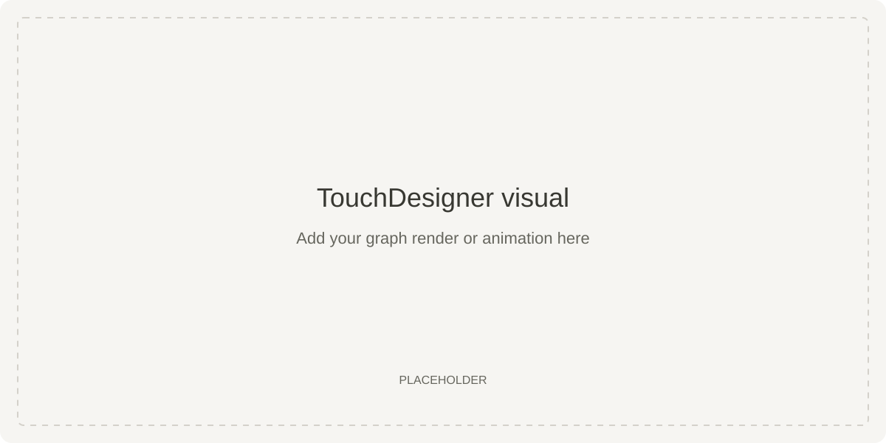
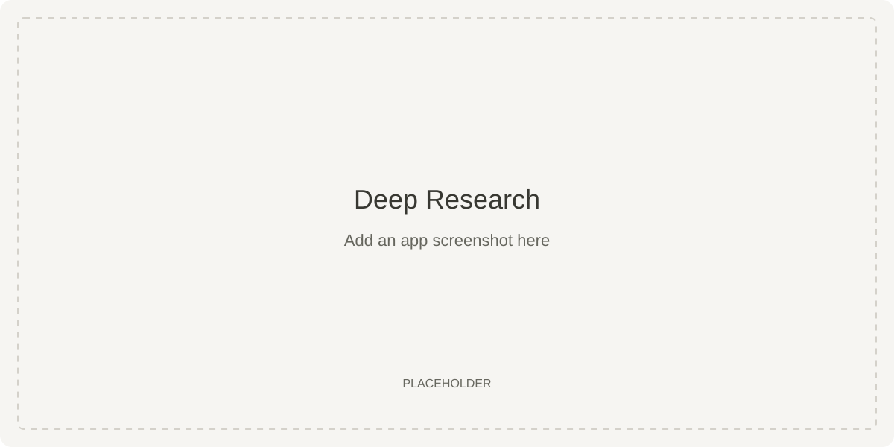
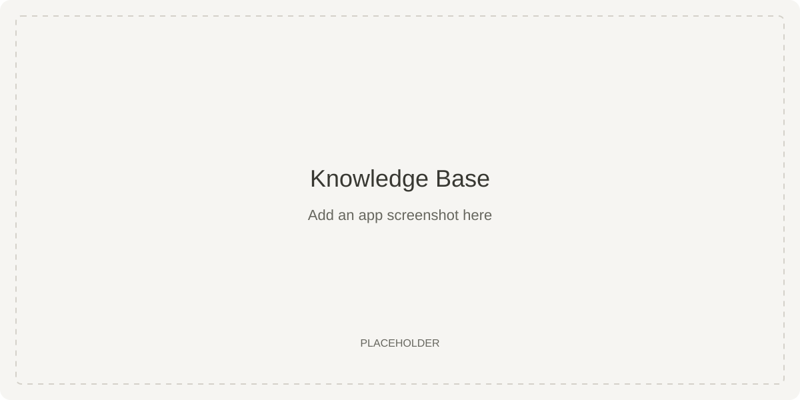

# Mementos

An AI research and personal knowledge notebook with a TouchDesigner graph visualization.

- Research a question and follow the search process as it streams.
- Save sources, search documents, and chat with citations using LightRAG.
- Export a 3D knowledge graph and retrieval highlights to TouchDesigner.

**Built with:** Next.js · TypeScript · FastAPI · LangGraph · LightRAG · Qdrant

## TouchDesigner visual



Naive RAG systems use a vector database, enter a question, find the closest vectors (nodes), and use them. In graph retrieval systems like LightRAG, a language model indexes the database to find semantic similarities between nodes. It would then do a high-breadth search traversing semantic distance, edges between nodes, global and local searches to output the best retrieval results. This demo shows a 3D representation of a LightRAG-indexed vector database and the physical distance between related and unrelated sources, as well as indexed edges between them.

## App screenshots





[Add your visuals](assets/README.md) · [TouchDesigner bridge](docs/touchdesigner.md)

This app uses a custom Deep Research pipeline inspired by the [SIRA](https://arxiv.org/html/2605.06647v1) paper. It creates a sketch of expected research results and a research orchestrator to loop with different search queries until the sketch is met. You can chat with your sources in the Knowledge base and get hyper-specific results that use your research, not pre-training data (reducing hallucination rate!)

## Run locally

Requires Node.js 20.9+, Python 3.12+, Docker Compose, and OpenAI-compatible and Tavily API keys.

```bash
cp .env.example .env
# Add your API keys to .env.
bash start.sh
```

Open [localhost:3000](http://localhost:3000). First launch installs dependencies and downloads embedding models when needed.

[Manual setup and checks](docs/setup.md) · [MIT license](LICENSE)
