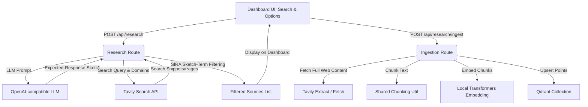

# Detailed Implementation Plan & Tasks: SIRA Deep-Research

This document outlines the step-by-step technical implementation tasks and subtasks for adding the SIRA (Superintelligent Retrieval Agent) inspired deep-research framework to the Second Brain application.

---

## Major Components and Architectures

---

## Phase 1: Shared Infrastructure

### Task 1: Environment & Text Utilities Setup
Move file chunking utilities into a shared module and ensure the system environment variables are correctly structured.

- [ ] **Subtask 1.1: Configure Environment Variables**
  - Verify presence of `.env` (or create `.env.local` if not present).
  - Add placeholders/keys:
    - `OPENAI_API_BASE` (OpenAI-compatible API base url, defaults to `https://api.openai.com/v1`)
    - `OPENAI_API_KEY` (API authentication key)
    - `OPENAI_MODEL_NAME` (e.g. `gpt-4o`, `llama-3`)
    - `TAVILY_API_KEY` (Tavily search authentication key)
- [ ] **Subtask 1.2: Refactor `splitTextIntoChunks`**
  - Create a new file `app/lib/text.ts`.
  - Extract `splitTextIntoChunks` from `app/app/api/ingest/route.ts` and place it in `app/lib/text.ts`.
  - Export `splitTextIntoChunks` from `app/lib/text.ts`.
  - Update `app/app/api/ingest/route.ts` to import `splitTextIntoChunks` from `@/lib/text`.
  - **Acceptance Criteria**: Existing file ingestion remains functional and compiles without syntax errors.
  - **Verification**: Run `npm run build` or start dev server and ingest a test file to verify standard ingestion works.
  - **Files**: `app/lib/text.ts`, `app/app/api/ingest/route.ts`

---

## Phase 2: Backend API Routes

### Task 2: Implement SIRA Deep Research Route (`app/app/api/research/route.ts`)
This API endpoint receives the user's research query, domains, and filetype constraints, generates the SIRA Expected-Response Sketch, executes search queries, filters results, and returns them.

- [ ] **Subtask 2.1: Request Validation & Parameter Parsing**
  - Create `/api/research/route.ts` structure.
  - Parse request parameters: `query` (string), `domains` (array of strings, optional), `filetypes` (array of strings, optional).
  - Validate parameters (return 400 if `query` is missing or empty).
- [ ] **Subtask 2.2: Generate SIRA Expected-Response Sketch**
  - Construct a prompt instructing the LLM to output a JSON object containing:
    1. `expectedConcepts`: array of key concepts/theories.
    2. `discriminativeTerms`: array of specific keywords, jargon, and names expected in high-quality sources.
    3. `searchQueries`: array of optimized search query strings (e.g. incorporating site constraints or formatted terms).
  - Execute chat completion POST request to `${OPENAI_API_BASE}/chat/completions`.
  - Parse and extract the structured JSON sketch.
- [ ] **Subtask 2.3: Execute Tavily Web Search**
  - Loop over the generated `searchQueries` (or fire them in parallel).
  - For each search query, call Tavily search API. If domains are provided, append `site:domain` or configure Tavily's `include_domains`/`exclude_domains` options.
  - Accumulate search results: URL, title, snippet. Deduplicate by URL.
- [ ] **Subtask 2.4: Apply SIRA Sketch-Term Filtering**
  - For each deduplicated search result:
    - Score the result based on the percentage of `discriminativeTerms` or `expectedConcepts` found in its title or snippet.
    - Set a configurable relevance threshold (e.g., minimum 1 matching term).
    - Sort results by the SIRA match score.
  - Return JSON response containing:
    - `sketch`: the generated Expected-Response Sketch.
    - `sources`: the ranked list of matching sources (URL, title, snippet, score).
  - **Acceptance Criteria**: Calling `/api/research` returns a JSON object containing both the LLM's query plan/sketch and the ranked list of sources.
  - **Verification**: Send mock request via `curl` or test script, inspect response structure.
  - **Files**: `app/app/api/research/route.ts`

### Task 3: Implement Web Page Ingestion Route (`app/app/api/research/ingest/route.ts`)
This endpoint accepts selected source URLs, fetches their full content, chunks, embeds, and saves them to Qdrant.

- [ ] **Subtask 3.1: Scrape/Fetch Full Web Content**
  - Receive list of sources (URL, title) and target `collection` name.
  - For each source:
    - Try fetching page content using Tavily's Extract API (if available/supported by user key) or standard HTTP fetch.
    - If standard HTTP fetch, parse the HTML response and strip script, style, and navigation tags, extracting only clean inner paragraph/heading text.
- [ ] **Subtask 3.2: Chunk Extracted Text**
  - Pass the cleaned full text to `splitTextIntoChunks` from `@/lib/text` with user-configurable chunk size (default: 500) and overlap (default: 50).
- [ ] **Subtask 3.3: Generate Local Embeddings & Prepare Vectors**
  - Loop over all chunks.
  - Call `getEmbedding(chunk.text)` from `@/lib/embeddings` (Xenova local model).
  - Construct Qdrant points with UUID, vector, and payload:
    - `text`: chunk's text content.
    - `filename`: the source webpage title/URL.
    - `url`: the webpage source URL.
    - `chunk_index`: chunk sequence index.
    - `char_start`: chunk start pointer.
    - `char_end`: chunk end pointer.
- [ ] **Subtask 3.4: Upsert Points into Qdrant Collection**
  - Verify that the target collection exists in Qdrant (else return error).
  - Upsert all generated points to the collection.
  - Return JSON status summarizing: total chunks ingested, success list of URLs, and elapsed processing time.
  - **Acceptance Criteria**: Ingesting web sources populates the Qdrant database with full page chunks, fully queryable via the existing search dashboard.
  - **Verification**: Perform ingestion, and run a vector search to verify web chunks are retrieved.
  - **Files**: `app/app/api/research/ingest/route.ts`

---

## Phase 3: Frontend Dashboard Integration

### Task 4: UI Design and Client Code Integration (`app/app/page.tsx`)
Create a responsive, aesthetically pleasing Deep Research user interface matching the existing Light Academia styling.

- [ ] **Subtask 4.1: UI Layout Design**
  - Place a new "Deep Research (SIRA)" card container next to or below the current Ingest File section.
  - Add text inputs:
    - Research Query Box (Text Area).
    - Limit Domains (Text Input, comma-separated e.g. `arxiv.org, github.com`).
    - Limit Filetypes (Select or dropdown options e.g. `All`, `pdf`, `html`).
  - Add "Run Deep Research" action button.
- [ ] **Subtask 4.2: Expected-Response Sketch & Sources UI**
  - Render a visual breakdown of SIRA's thinking:
    - List generated "Expected Terms" and "Concepts" in pill format.
  - Render a table or list of matching search sources with checkboxes.
  - Add checkboxes: "Select All", and individual checkboxes for each source.
  - Show the matching relevance score next to each source.
- [ ] **Subtask 4.3: Ingestion Panel & Action Trigger**
  - Provide a drop-down selector to choose the target collection.
  - Provide input fields for Chunk Size (default: 500) and Chunk Overlap (default: 50).
  - Add an "Ingest Selected Sources" button.
  - Add status text/spinners displaying ingestion steps (e.g. "Scraping page 1...", "Embedding page 2...", "Finished").
  - **Acceptance Criteria**: Seamless interface integration that does not break the layout or styling of the existing page.
  - **Files**: `app/app/page.tsx`

### Task 5: CSS Stylesheets & Visual Polish (`app/app/page.module.css`)
Style all new elements using premium CSS design systems (colors, layout spacing, micro-animations, custom checkbox styling).

- [ ] **Subtask 5.1: Create CSS Variables & Classes**
  - Define custom variables or class stylings for the research container, sketch pills, source results list, and progress indicators.
  - Add hover animations for pills and source rows.
- [ ] **Subtask 5.2: CSS Layout Verification**
  - Ensure responsive wrapping for smaller screen widths.
  - **Acceptance Criteria**: Clean layout, clear visual hierarchy, fits the aesthetic theme.
  - **Files**: `app/app/page.module.css`
